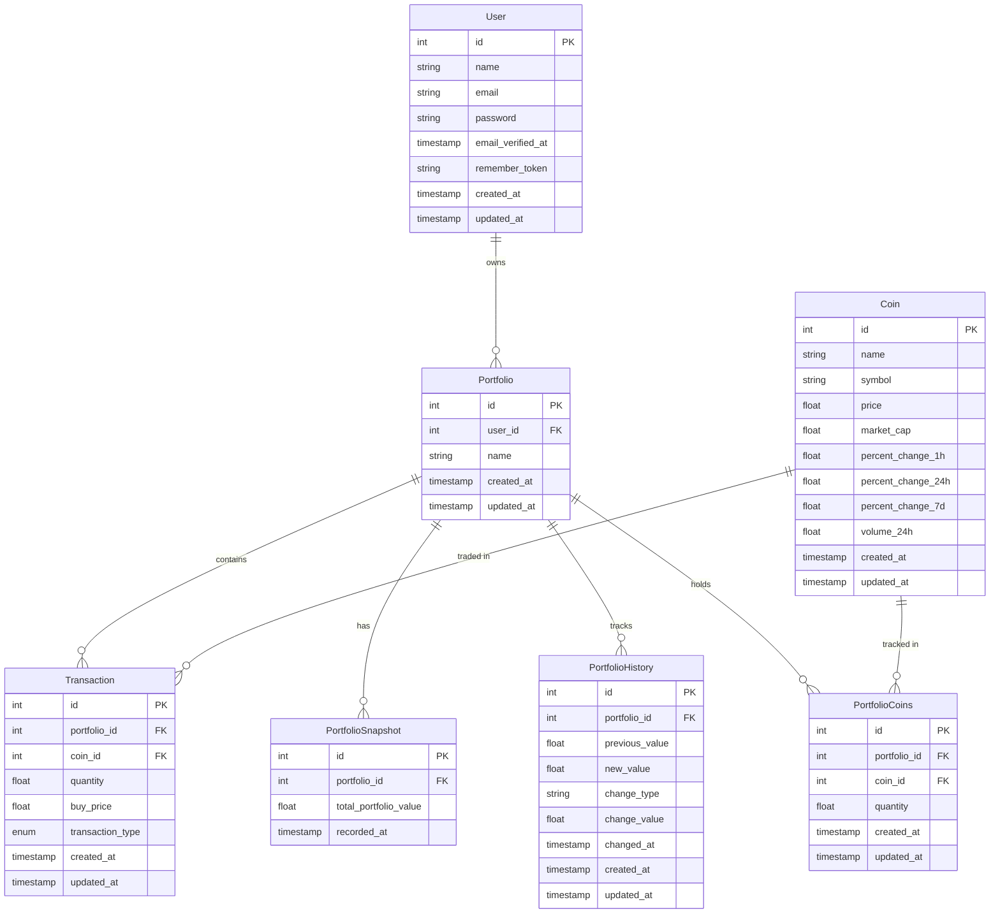

<p align="center">
    
</p>

# Regulus - Crypto Portfolio Manager

Regulus empowers users to track, analyze, and manage their cryptocurrency investments with real-time market data and portfolio analytics.

## Features

✨ **Manage Multiple Portfolios** - Organize investments across different portfolios  
📈 **Track Real-time Prices** - Monitor live market data updates  
💹 **Record Transactions** - Maintain records of all buy/sell activities  
📊 **Analyze Performance** - Track investment performance over time  

## Quick Start

### Requirements
- PHP 8.1+
- Composer
- Node.js & npm
- MySQL or PostgreSQL
- Docker (optional, for Laravel Sail)
- Cryptocurrency API key

### Installation Steps

1. **Clone and install**
```bash
git clone <your-repo-url>
cd regulus-app-v2
composer install
npm install
```

2. **Environment setup**
```bash
cp .env.example .env
php artisan key:generate
```

3. **Database configuration**
Update `.env` file with database credentials:
```env
DB_DATABASE=regulus_db
DB_USERNAME=your_username
DB_PASSWORD=your_password
```

4. **Database setup**
```bash
php artisan migrate
```

5. **Build and run**
```bash
npm run dev
php artisan serve
```

Application will be available at `http://localhost:8000`

## Complete Installation Guide

Detailed setup process with all available options:

### 1. Repository Setup
```bash
git clone <your-repo-url>
cd regulus-app-v2
```

### 2. Dependencies Installation
```bash
# Core Laravel dependencies
composer install

# Development tools
composer require laravel/sail --dev
composer require -W --dev laravel-shift/blueprint

# Essential packages
composer require laravel/sanctum pusher/pusher-php-server laravel/horizon

# Frontend dependencies
npm install
npm install --save laravel-echo pusher-js axios
```

### 3. Configuration
```bash
# Environment setup
cp .env.example .env
php artisan key:generate
php artisan storage:link
```

Update `.env` file:
```env
# Database
DB_CONNECTION=mysql
DB_HOST=127.0.0.1
DB_PORT=3306
DB_DATABASE=regulus_db
DB_USERNAME=your_username
DB_PASSWORD=your_password

# Crypto API
COIN_API_KEY=your_api_key_here
```

### 4. Database & Services Setup
```bash
# Database
php artisan migrate
php artisan db:seed  # Optional sample data

# Services
php artisan install:broadcasting
php artisan horizon:install
```

### 5. Deployment Options

**🐳 Docker (Recommended)**
```bash
php artisan sail:install
./vendor/bin/sail up -d
./vendor/bin/sail artisan migrate
```

**🖥️ Traditional Setup**
```bash
php artisan serve
php artisan queue:work
php artisan horizon
npm run dev
```

### 6. Application Access
- **Application**: http://localhost:8000
- **Queue Monitor**: http://localhost:8000/horizon

### Troubleshooting
```bash
php artisan cache:clear
php artisan config:clear
php artisan route:clear
```

## Database Structure

Entity relationship diagram:



## Need Help?

- Check `.env` file if something's not working
- Make sure database is running
- Execute `php artisan cache:clear` for troubleshooting

## Tips

- Execute `php artisan queue:work` to handle background tasks
- Execute `npm run build` for  JS environment build
- Keep your API keys safe in the `.env` file
